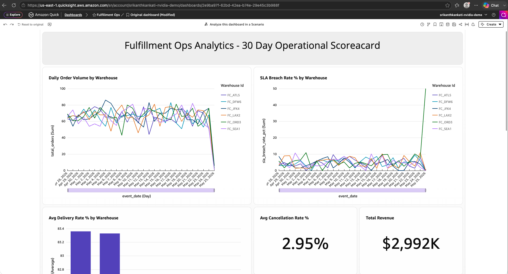
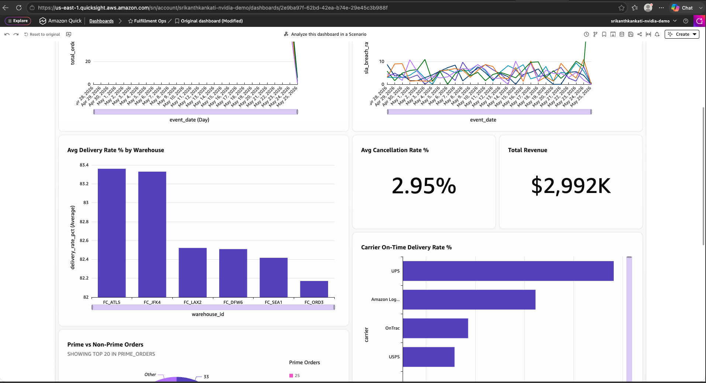
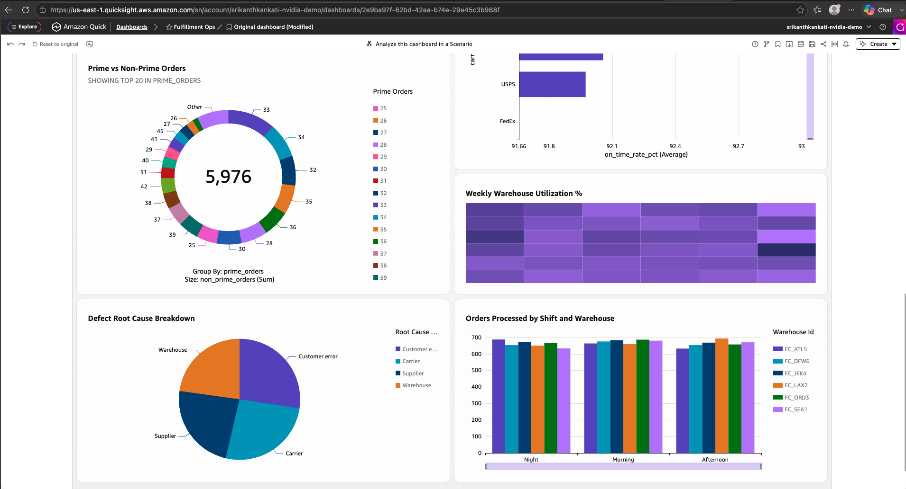

# Fulfillment Ops Analytics
### End-to-End AWS Data Engineering Pipeline | Amazon BIE Portfolio Project

[](docs/1FOPS.png)

> **Live Dashboard:** Built on Amazon QuickSight connected to Redshift Serverless. [View screenshots below.](#quicksight-dashboard)
A fully production-grade data engineering project built on the AWS ecosystem, simulating an Amazon fulfillment center operational analytics platform. Covers the complete BIE stack: data generation, S3 data lake, Glue ETL, Redshift star schema, and QuickSight BI dashboard — all running on real AWS infrastructure.

---

## Live Architecture

```
Raw Data Sources
      │
      ▼
Amazon S3 (Raw Landing Zone)
fulfillment-ops-raw-srikanth-2026
  ├── order_events/date=YYYY-MM-DD/
  ├── shipment_tracking/date=YYYY-MM-DD/
  ├── warehouse_capacity/
  └── returns_defects/
      │
      ▼
AWS Glue ETL (PySpark)
fulfillment-ops-cleanse
  ├── inferSchema=False, explicit type casting
  ├── ROW_NUMBER() deduplication on primary keys
  ├── SCD Type 2 on warehouse dimensions
  ├── Derived columns: fulfillment_speed_tier, delivery_delay_hours
  └── Watermark-based incremental loading
      │
      ▼
Amazon S3 (Curated Zone)
fulfillment-ops-curated-srikanth-2026
  └── Cleaned Parquet files per dataset
      │
      ▼
Amazon Redshift Serverless
fulfillment-ops-wg | fulfillment_ops database
  ├── ops_staging schema (4 staging tables)
  ├── ops schema (3 fact tables + 4 dim tables)
  │     ├── fact_order          (12,000 rows)
  │     ├── fact_shipment       (11,640 rows)
  │     ├── fact_returns_defects   (978 rows)
  │     ├── dim_warehouse          (186 rows, SCD Type 2)
  │     ├── dim_date             (1,461 rows, full date spine)
  │     ├── dim_carrier             (10 rows)
  │     └── dim_product_category    (20 rows)
  ├── 6 analytical views (v_daily_ops_scorecard, v_shift_performance, etc.)
  └── ops_audit schema (pipeline_run_log)
      │
      ▼
Amazon QuickSight
Fulfillment Ops Analytics - 30 Day Operational Scorecard
  ├── Daily Order Volume by Warehouse
  ├── SLA Breach Rate % by Warehouse
  ├── Avg Delivery Rate % by Warehouse
  ├── Carrier On-Time Delivery Rate %
  ├── Orders Processed by Shift and Warehouse
  ├── Weekly Warehouse Utilization % (heatmap)
  ├── Defect Root Cause Breakdown
  ├── Prime vs Non-Prime Orders
  ├── Avg Cancellation Rate % KPI
  └── Total Revenue KPI ($2,992K)
```

---

## AWS Infrastructure

| Service | Resource | Region |
|---|---|---|
| S3 | `fulfillment-ops-raw-srikanth-2026` | us-east-1 |
| S3 | `fulfillment-ops-curated-srikanth-2026` | us-east-1 |
| Glue | `fulfillment-ops-cleanse` (Glue 4.0, G.1X, 2 workers) | us-east-1 |
| IAM | `FulfillmentGlueRole` | Global |
| Redshift Serverless | `fulfillment-ops-wg` / `fulfillment-ops-ns` | us-east-1 |
| QuickSight | `fulfillment-ops-wg` SPICE dataset | us-east-1 |

---

## Dataset Overview

| Dataset | Rows | Description |
|---|---|---|
| `order_events` | 12,000 | Full order lifecycle across 6 fulfillment centers |
| `shipment_tracking` | 11,640 | Carrier-level delivery tracking per shipped order |
| `warehouse_capacity` | 186 | Daily capacity snapshot per FC (31 days x 6 FCs) |
| `returns_defects` | 978 | Return and defect reports with root cause classification |

### Simulated Business Metrics

| KPI | Value |
|---|---|
| Total Orders | 12,000 |
| Total Revenue | $2,992,342 |
| Avg Order Value | $249.36 |
| Delivery Rate | 85.61% |
| SLA Breach Rate | 4.79% |
| Cancellation Rate | 3.0% |
| Return Rate | 4.73% |
| Avg Processing Hours | 9.49 hrs |
| Prime Order Mix | 50.2% |
| Late Delivery Rate | ~8% |

---

## Project Structure

```
fulfillment-ops-analytics/
│
├── data_sim/
│   ├── generate_data.py        # Simulates 12,000 orders + 3 supporting datasets
│   ├── data_validator.py       # 34 automated QA checks before S3 upload
│   ├── requirements.txt
│   └── README.md
│
├── glue_jobs/
│   ├── orders_shipments_cleanse.py   # PySpark ETL: cleanse, dedupe, SCD Type 2
│   ├── redshift_staging_loader.py    # COPY + upsert pattern into Redshift
│   ├── run_local.py                  # Local test runner (no AWS needed)
│   └── README.md
│
├── redshift/
│   ├── schema.sql              # Full star schema DDL (fact + dim + staging + audit)
│   ├── copy_commands.sql       # S3 COPY commands + upsert scripts
│   └── analytical_queries.sql  # 6 analytical views powering QuickSight
│
├── docs/
│   ├── dashboard_overview.png
│   ├── dashboard_scorecard.png
│   └── dashboard_carrier.png
│
└── README.md
```

---

## Redshift Star Schema

```
                    dim_date
                       │
dim_product_category   │    dim_carrier
         │             │         │
         └─────────────┼─────────┘
                       │
              fact_order (12,000 rows)
              DISTKEY: warehouse_id
              SORTKEY: event_date, warehouse_id
                       │
              fact_shipment (11,640 rows)
              DISTKEY: warehouse_id
              SORTKEY: event_date, warehouse_id
                       │
         dim_warehouse (SCD Type 2)
         effective_start_date / effective_end_date / is_current
```

---

## Key Engineering Patterns

**Watermark-based incremental loading.** The Glue job only processes S3 partitions where `date >= WATERMARK_DATE`. This avoids reprocessing historical data on every run — the same pattern used in production ETL pipelines at scale.

**SCD Type 2 on warehouse dimensions.** Each warehouse capacity snapshot is tracked with `effective_start_date`, `effective_end_date`, and `is_current` columns, preserving the full history of changes over time.

**Redshift upsert pattern.** Since older Redshift versions don't support `MERGE`, the pipeline uses a DELETE + INSERT pattern inside a transaction. Staging tables are truncated before each COPY, ensuring idempotent loads.

**34 automated data quality checks.** Before any data reaches S3, `data_validator.py` runs checks covering null rates, duplicate primary keys, referential integrity, business logic bounds, and date range completeness.

**DISTKEY and SORTKEY optimization.** Fact tables are distributed on `warehouse_id` so joins with `dim_warehouse` are co-located. Sort keys on `event_date` enable zone map pruning on time-range queries — the most common filter pattern on operational dashboards.

---

## QuickSight Dashboard

The dashboard connects to Redshift Serverless via SPICE for sub-second query performance. Six analytical views serve as the dataset layer:

| View | Purpose |
|---|---|
| `v_daily_ops_scorecard` | Daily KPIs per warehouse (volume, rates, revenue) |
| `v_shift_performance` | Throughput and SLA breach rate by shift |
| `v_carrier_performance` | On-time rate and delay analysis with 7-day rolling avg |
| `v_defect_analysis` | Root cause breakdown by warehouse and category |
| `v_warehouse_utilization` | Capacity vs throughput with WoW change |
| `v_executive_summary` | Single-row 30-day KPI rollup for scorecard tiles |

---

### Dashboard Screenshots





## Running Locally

```bash
# Step 1 — Generate data (no pip installs needed)
python3 data_sim/generate_data.py

# Step 2 — Validate data quality (34 checks)
pip3 install pandas
python3 data_sim/data_validator.py --out ./output

# Step 3 — Run Glue ETL locally (PySpark)
pip3 install pyspark
python3 glue_jobs/run_local.py
```

Output folders:
- `output/` — raw CSVs, S3-ready with date partitioning
- `curated/` — cleaned Parquet files
- `sql_output/redshift_load_plan.sql` — full Redshift load SQL

---

## AWS Deployment

```bash
# Upload raw data to S3
aws s3 sync ./output/ s3://your-raw-bucket/ --region us-east-1

# Upload Glue script
aws s3 cp glue_jobs/orders_shipments_cleanse.py \
  s3://your-raw-bucket/glue-scripts/ --region us-east-1

# Run Glue job
aws glue start-job-run \
  --job-name fulfillment-ops-cleanse --region us-east-1

# Run schema in Redshift Query Editor v2
# Open redshift/schema.sql and execute against fulfillment_ops database

# Load data into Redshift
# Open redshift/copy_commands.sql and execute
```

---

## Skills Demonstrated

- AWS Glue (PySpark ETL, Glue 4.0, G.1X workers, job parameters)
- Amazon S3 (partitioned data lake, raw and curated zones)
- Amazon Redshift Serverless (star schema, DISTKEY, SORTKEY, COPY, upsert)
- Amazon QuickSight (SPICE datasets, 10 visuals, published dashboard)
- Python (data simulation, automated QA, argparse CLI)
- SQL (window functions, CTEs, analytical views, SCD Type 2)
- Data modeling (Medallion Architecture, dimensional modeling, staging pattern)
- IAM (role creation, trust policies, S3 and Redshift permissions)

---

## Author

**Srikanth Kankati**
BI Developer | Data Engineer
[LinkedIn](https://linkedin.com/in/srikanthkankati) | [GitHub](https://github.com/srikanthkankati)
